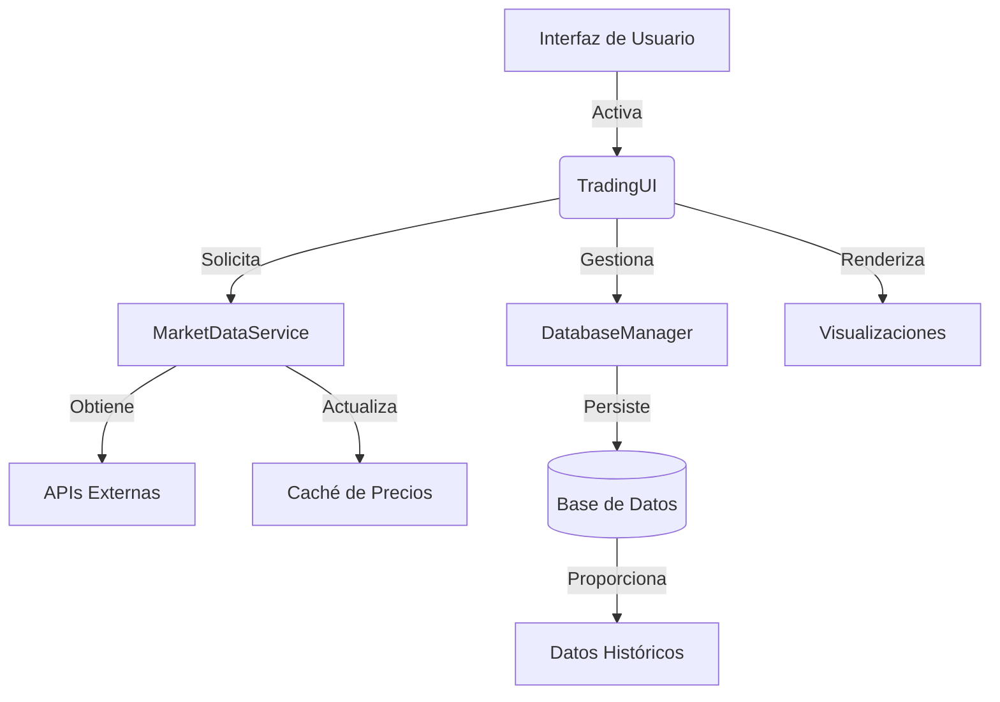

# Análisis del Panel de Bots de CryptoPlaza

## Descripción General de la Estructura de la Aplicación

### 1. Componentes Principales
- **Sistema de Registro**: Registro configurable con múltiples manejadores y rotación
- **Gestión de Configuración**: Basado en YAML con soporte para variables de entorno
- **Capa de Base de Datos**: ORM SQLAlchemy con agrupación de conexiones y gestión de sesiones
- **Lógica de Trading**: Cálculos Fibonacci con estrategias basadas en momentum
- **Datos de Mercado**: Obtención concurrente de precios con caché
- **Interfaz Web**: Panel de control basado en Streamlit con visualizaciones en tiempo real

### 2. Patrones Arquitectónicos Clave
- Arquitectura en Capas (Datos -> Lógica de Negocio -> Presentación)
- Sesiones de Base de Datos Seguras para Hilos
- Obtención Concurrente de Datos de Mercado
- Parámetros de Seguridad Configurables
- Componentes de UI Responsivos

---

## Desglose Detallado de Componentes

### 1. Infraestructura de Registro (`LoggerSetup`)
```python
class LoggerSetup:
    @staticmethod
    def setup_logging(log_path: str = "logs") -> None
```
**Características**:
- Manejadores de archivos rotativos (archivos de 10MB)
- Registro de errores separado
- Formato de registro estructurado
- Registro multinivel (DEBUG a CRITICAL)

### 2. Gestión de Configuración
```python
@dataclass
class DatabaseConfig:
@dataclass 
class SecurityConfig:
@dataclass
class TradingConfig:

class ConfigLoader:
    @staticmethod
    def load_config(config_path: str = "config.yaml") -> Dict[str, Any]
```
**Aspectos Clave**:
- Sustitución de variables de entorno
- Objetos de configuración con seguridad de tipos
- Carga de configuración YAML
- Validación mediante dataclasses

### 3. Capa de Base de Datos
#### 3.1 Modelos
```python
class User(Base, TimestampMixin):
    # Columnas: id, username, password_hash, etc.
    @staticmethod
    def hash_password()
    def verify_password()

class TradingPair(Base, TimestampMixin):
    # Columnas: symbol, momentum, fib_high/low, etc.
    def price_distance()
    @staticmethod
    def validate_prices()
```

#### 3.2 Gestión de Base de Datos
```python
class DatabaseManager:
    def __init__(self, config: DatabaseConfig)
    def session_scope()  # Gestor de contexto
    def recreate_tables()
```
**Características**:
- Agrupación de conexiones
- Seguimiento de versiones de esquema
- Sesiones locales de hilo
- Hooks de ciclo de vida de transacciones

### 4. Motor de Trading
#### 4.1 Cálculos Fibonacci
```python
class FibonacciCalculator:
    @classmethod
    def calculate_zones() -> FibonacciZones
```

#### 4.2 Servicio de Datos de Mercado
```python
class MarketDataService:
    def get_prices() -> Dict[str, float]
    @retry()  # Mecanismo de reintento automático
    def _fetch_price()
```
**Características**:
- Caché de precios seguro para hilos
- Obtención concurrente de precios
- Intervalos de actualización configurables
- Resistencia a errores

### 5. Interfaz de Usuario
```python
class TradingUI:
    def run()
    def _render_dashboard()
    def _render_active_pairs()
    def _render_ranking_interface()
```
**Componentes de UI**:
- Tarjetas interactivas de pares
- Clasificaciones de rendimiento
- Gráficos de precios en tiempo real
- Controles de gestión de pares
- Gestión de sesiones

---

## Metodologías Clave

### 1. Implementación de Seguridad
- Hashing de contraseñas con Bcrypt (12 rondas)
- Manejo de expiración de sesiones
- Seguimiento de intentos de inicio de sesión fallidos
- Configuración basada en entorno

### 2. Optimizaciones de Rendimiento
- ThreadPoolExecutor para obtención concurrente de precios
- Agrupación de conexiones SQLAlchemy
- Caché de precios con tiempo de espera
- Operaciones de base de datos por lotes

### 3. Manejo de Errores
- Jerarquía de excepciones personalizada
- Reversiones de transacciones de base de datos
- Decoradores de reintento para datos de mercado
- Registro completo

### 4. Técnicas de Visualización
- Gráficos interactivos Plotly
- Indicadores de progreso
- Visualizaciones de momentum con códigos de color
- Diseños de cuadrícula responsivos

---

## Diagrama de Flujo de Datos



---

## Dependencias Críticas

| Dependencia | Propósito |
|------------|---------|
| Streamlit | Framework de UI Web |
| SQLAlchemy | ORM & Base de Datos |
| Plotly | Gráficos Interactivos |
| TradingView-TA | Análisis de Datos de Mercado |
| bcrypt | Hashing de Contraseñas |
| Tenacity | Mecanismo de Reintento |

---

## Ejemplo de Configuración (YAML)

```yaml
database:
  url: "sqlite:///trading.db"
  pool_size: 5
  max_overflow: 10

security:
  bcrypt_rounds: 12
  session_expiry: 3600

trading:
  screener: "crypto"
  exchange: "BYBIT"
  interval: "1d"
```

---

## Resumen de Características Clave

1. **Monitoreo en Tiempo Real**  
   Seguimiento de múltiples pares criptográficos con zonas de entrada basadas en Fibonacci

2. **Cálculos Automatizados**  
   Ajustes dinámicos de zonas Fibonacci basados en momentum del mercado

3. **Gestión de Riesgos**  
   Indicadores visuales de distancia de precios y seguimiento de estado

4. **Características Empresariales**  
   - Agrupación de conexiones
   - Gestión de sesiones
   - Pistas de auditoría
   - Fortalecimiento de seguridad

5. **Resistencia Operacional**  
   - Reintentos automáticos
   - Seguridad de transacciones
   - Registro completo
   - Procesamiento concurrente

6. **Experiencia de Usuario**  
   - Diseño responsivo
   - Visualizaciones interactivas
   - Controles intuitivos
   - Actualizaciones en tiempo real
