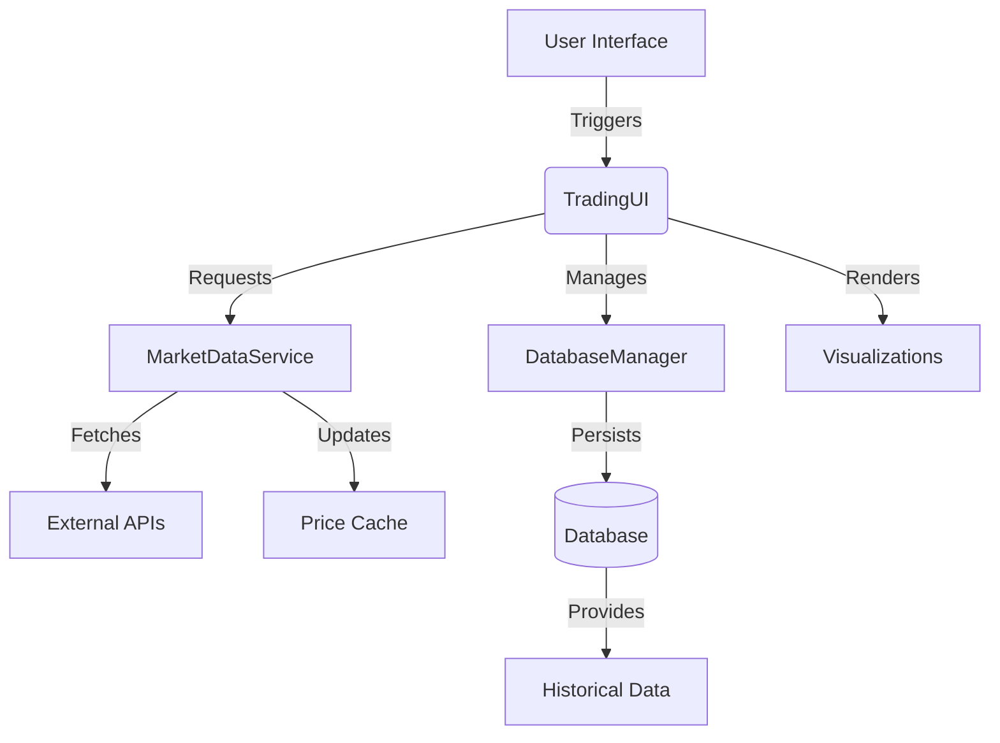

# CryptoPlaza Trading Dashboard Analysis

## Application Structure Overview

### 1. Core Components
- **Logging System**: Configurable multi-handler logging with rotation
- **Configuration Management**: YAML-based with environment variable support
- **Database Layer**: SQLAlchemy ORM with connection pooling and session management
- **Trading Logic**: Fibonacci calculations with momentum-based strategies
- **Market Data**: Concurrent price fetching with caching
- **Web UI**: Streamlit-based dashboard with real-time visualizations

### 2. Key Architectural Patterns
- Layered Architecture (Data -> Business Logic -> Presentation)
- Thread-safe Database Sessions
- Concurrent Market Data Fetching
- Configurable Security Parameters
- Responsive UI Components

---

## Detailed Component Breakdown

### 1. Logging Infrastructure (`LoggerSetup`)
```python
class LoggerSetup:
    @staticmethod
    def setup_logging(log_path: str = "logs") -> None
```
**Features**:
- Rotating file handlers (10MB files)
- Separate error logging
- Structured log formatting
- Multi-level logging (DEBUG to CRITICAL)

### 2. Configuration Management
```python
@dataclass
class DatabaseConfig:
@dataclass 
class SecurityConfig:
@dataclass
class TradingConfig:

class ConfigLoader:
    @staticmethod
    def load_config(config_path: str = "config.yaml") -> Dict[str, Any]
```
**Key Aspects**:
- Environment variable substitution
- Type-safe configuration objects
- YAML configuration loading
- Validation through dataclasses

### 3. Database Layer
#### 3.1 Models
```python
class User(Base, TimestampMixin):
    # Columns: id, username, password_hash, etc.
    @staticmethod
    def hash_password()
    def verify_password()

class TradingPair(Base, TimestampMixin):
    # Columns: symbol, momentum, fib_high/low, etc.
    def price_distance()
    @staticmethod
    def validate_prices()
```

#### 3.2 Database Management
```python
class DatabaseManager:
    def __init__(self, config: DatabaseConfig)
    def session_scope()  # Context manager
    def recreate_tables()
```
**Features**:
- Connection pooling
- Schema version tracking
- Thread-local sessions
- Transaction lifecycle hooks

### 4. Trading Engine
#### 4.1 Fibonacci Calculations
```python
class FibonacciCalculator:
    @classmethod
    def calculate_zones() -> FibonacciZones
```

#### 4.2 Market Data Service
```python
class MarketDataService:
    def get_prices() -> Dict[str, float]
    @retry()  # Automatic retry mechanism
    def _fetch_price()
```
**Features**:
- Thread-safe price caching
- Concurrent price fetching
- Configurable refresh intervals
- Error resilience

### 5. User Interface
```python
class TradingUI:
    def run()
    def _render_dashboard()
    def _render_active_pairs()
    def _render_ranking_interface()
```
**UI Components**:
- Interactive pair cards
- Performance rankings
- Real-time price charts
- Pair management controls
- Session management

---

## Key Methodologies

### 1. Security Implementation
- Bcrypt password hashing (12 rounds)
- Session expiration handling
- Failed login tracking
- Environment-based configuration

### 2. Performance Optimizations
- ThreadPoolExecutor for concurrent price fetching
- SQLAlchemy connection pooling
- Price caching with timeout
- Batch database operations

### 3. Error Handling
- Custom exception hierarchy
- Database transaction rollbacks
- Retry decorators for market data
- Comprehensive logging

### 4. Visualization Techniques
- Plotly interactive charts
- Progress indicators
- Color-coded momentum displays
- Responsive grid layouts

---

## Data Flow Diagram



---

## Critical Dependencies

| Dependency | Purpose |
|------------|---------|
| Streamlit | Web UI Framework |
| SQLAlchemy | ORM & Database |
| Plotly | Interactive Charts |
| TradingView-TA | Market Data Analysis |
| bcrypt | Password Hashing |
| Tenacity | Retry Mechanism |

---

## Configuration Example (YAML)

```yaml
database:
  url: "sqlite:///trading.db"
  pool_size: 5
  max_overflow: 10

security:
  bcrypt_rounds: 12
  session_expiry: 3600

trading:
  screener: "crypto"
  exchange: "BYBIT"
  interval: "1d"
```

---

## Summary of Key Features

1. **Real-time Monitoring**  
   Track multiple crypto pairs with Fibonacci-based entry zones

2. **Automated Calculations**  
   Dynamic Fibonacci zone adjustments based on market momentum

3. **Risk Management**  
   Visual price distance indicators and status tracking

4. **Enterprise Features**  
   - Connection pooling
   - Session management
   - Audit trails
   - Security hardening

5. **Operational Resilience**  
   - Automatic retries
   - Transaction safety
   - Comprehensive logging
   - Concurrent processing

6. **User Experience**  
   - Responsive design
   - Interactive visualizations
   - Intuitive controls
   - Real-time updates
